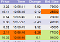

# Lightstreamer - Basic Stock-List Demo - HTML (GWT) Client #

<!-- START DESCRIPTION lightstreamer-example-stocklist-client-gwt -->

This project contains a demo client showing integration between the Lightstreamer JavaScript Client API library and [Google Web Toolkit (GWT)](http://code.google.com/webtoolkit/).

<table>
  <tr>
    <td style="text-align: left">
      &nbsp;&nbsp;
      
    </td>
    <td>
      &nbsp;An online demonstration is hosted on our servers at: 
      &nbsp;<a href="http://service.lightstreamer.com/GWT_StockListDemo_Basic/" target="_blank">http://service.lightstreamer.com/GWT_StockListDemo_Basic/</a>
    </td>
  </tr>
</table>

This page uses the <b>JavaScript Client API for Lightstreamer</b> to handle the communications with Lightstreamer Server and uses a <b>GWT FlexTable</b> to display the real-time data pushed by Lightstreamer. 

The demo includes the following client-side technologies:
* A [Subscription](http://www.lightstreamer.com/docs/client_javascript_uni_api/Subscription.html) containing 10 items, subscribed to in <b>MERGE</b> mode.

## Dig the code ##

Some binding are made to the html page (war/GWT_StockListDemo_Basic.html) to let the demo work:
* The Lightstreamer JavaScript API Client library is included in the page. 
* A "lsGwtDynamic" div element is added to the page; this will be the place where the GWT FlexTable will be appended.
  
The <b>LSGWTLightstreamerClient</b> class wraps the LightstreamerClient object, which is the JavaScript class responsible of handling the connections and subscriptions to the Lightstreamer server. 
The <b>LSGWTSubscription</b> class wraps the Subscription JavaScript class, which represents a Lightstreamer subscription. It is an abstract class; its subclass <b>LSGWTDemoTable</b> extends its functionalities implementing the handling of the updates and publishing them to a GWT FlexTable.
  
Check out the sources for further explanations.
  
<i>NOTE: not all the functionalities of the Lightstreamer JavaScript Client API are exposed by  LSGWTLightstreamerClient and LSGWTSubscription. You can easily expand those functionalities using the [JavaScript Client API](http://www.lightstreamer.com/docs/client_javascript_uni_api/index.html) as a reference. 
If in trouble, check out the [specific Lightstreamer forum](http://www.lightstreamer.com/vb/forumdisplay.php?f=29).</i>

<!-- END DESCRIPTION lightstreamer-example-stocklist-client-gwt -->

# Build #

Before you can run the demo some dependencies need to be solved, please follow the instructions below otherwise you can run an online demonstration  hosted on our servers [here](http://service.lightstreamer.com/GWT_StockListDemo_Basic/). 
To directly import the project as is, you need the Eclipse IDE with the GWT plugin installed, go to [http://www.eclipse.org/](http://www.eclipse.org/) and download the latest eclipse distribution in its "classic" package.
  
Go to [http://code.google.com/webtoolkit/](http://code.google.com/webtoolkit/) and follow the instructions to install the plugin in eclipse. (Hint, this is the update site you need:  http://dl.google.com/eclipse/plugin/x.x where x.x is the eclipse version you have; e.g. 3.6).

<i>NOTE: You may also use the sources included in the zip with another IDE or without any IDE but such approach is not covered in this readme. In any case you need at least the GWT SDK.</i>

Obviously you also need to have the Lightstreamer 5.0 Colosseo server or newer installed somewhere. If you don't have it, go download it here: [http://www.lightstreamer.com/download](http://www.lightstreamer.com/download) and follow the instructions in the package to install it.
  
The next step is to complete your installation of the demo with a valid version of the Lightstreamer JavaScript Client API library. You can get the lib from here: <Lightstreamer HOME>\DOCS-SDKs\sdk_client_javascript\alternative_libs\ and copy the file named lightstreamer_globals.js into the war/lightstreamer folder of this project with the "lightstreamer.js" name. 
You're now ready to import the project into Eclipse. Click on File->Import... then under General select Existing Projects into Workspace and choose the folder where you've exported this project.

## Configure the demo ##
Before you start, only if you have changed the server configuration, open the "src/gwtdemo/client/lsconfig.properties" file contained in this zip and change the host and port settings according to your environment (port is the port the Lightstreamer server is listening on).

## Compile and Run ##

From Eclipse, to compile the application right-click on the project in the Package  Explorer and click Google->GWT Compile; you may want or need to change the configuration of the build, at the moment it is configured to be as fast as possible.
  
Once compiled, you have to start the servlet container (the Eclipse plugin ships with a Jetty installation): right click again on the project and select Debug As -> Web Application. Once started, a Development Mode view will appear containing a URL to be pasted on your browser.
It will look like this: "http://127.0.0.1:8888/GWT_StockListDemo_Basic.html?gwt.codesvr=127.0.0.1:9997" NOTE: do not use that URL as is but remove the ?gwt.codesvr=127.0.0.1:9997 and use this: "http://127.0.0.1:8888/GWT_StockListDemo_Basic.html".
  
NOTE: in case of trouble reaching the server you may need to edit the debug configuration; click on Run->Debug Configurations, select the configuration generated by the previous clicks and edit the Arguments tab adding -bindAddress 0.0.0.0 to the program arguments.

# See Also #

## Lightstreamer Adapters needed by this demo client ##
<!-- START RELATED_ENTRIES -->

* [Lightstreamer - Stock- List Demo - Java Adapter](https://github.com/Weswit/Lightstreamer-example-Stocklist-adapter-java)
* [Lightstreamer - Reusable Metadata Adapters- Java Adapter](https://github.com/Weswit/Lightstreamer-example-ReusableMetadata-adapter-java)

<!-- END RELATED_ENTRIES -->

## Similar demo clients that may interest you ##

* [Lightstreamer - Stock-List Demos - HTML Clients](https://github.com/Weswit/Lightstreamer-example-Stocklist-client-javascript)
* [Lightstreamer - Basic Stock-List Demo - jQuery (jqGrid) Client](https://github.com/Weswit/Lightstreamer-example-StockList-client-jquery)
* [Lightstreamer - Stock-List Demo - Dojo Toolkit Client](https://github.com/Weswit/Lightstreamer-example-StockList-client-dojo)
* [Lightstreamer - Basic Stock-List Demo - Java SE (Swing) Client](https://github.com/Weswit/Lightstreamer-example-StockList-client-java)
* [Lightstreamer - Basic Stock-List Demo - .NET Client](https://github.com/Weswit/Lightstreamer-example-StockList-client-dotnet)
* [Lightstreamer - Stock-List Demos - Flex Clients](https://github.com/Weswit/Lightstreamer-example-StockList-client-flex)
* [Lightstreamer - Basic Stock-List Demo - Silverlight Client](https://github.com/Weswit/Lightstreamer-example-StockList-client-silverlight)

# Lightstreamer Compatibility Notes #

- Compatible with Lightstreamer JavaScript Client library version 6.0 or newer.
