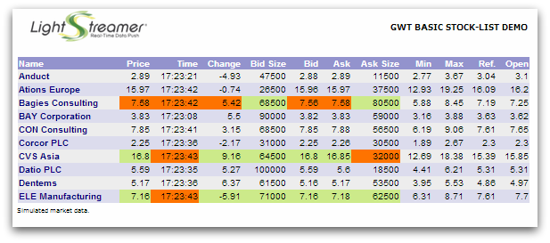

# Lightstreamer - Basic Stock-List Demo - HTML (GWT) Client

<!-- START DESCRIPTION lightstreamer-example-stocklist-client-gwt -->

This project contains a demo client showing integration between the [Lightstreamer Web Client API](https://lightstreamer.com/api/ls-web-client/latest/index.html) and [Google Web Toolkit (GWT)](http://code.google.com/webtoolkit/).

## Live Demo

 
### [ View live demo](http://demos.lightstreamer.com/GWT_StockListDemo_Basic/) 

## Details

This page uses the <b>Web Client SDK API for Lightstreamer</b> to handle the communications with Lightstreamer Server and uses a <b>GWT FlexTable</b> to display the real-time data pushed by Lightstreamer. 

The demo includes the following client-side functionalities:
* A [Subscription](https://lightstreamer.com/api/ls-web-client/latest/Subscription.html) containing 10 items, subscribed to in <b>MERGE</b> mode.

### Dig the Code

Some binding are made to the html page (war/GWT_StockListDemo_Basic.html) to let the demo work:
* The Lightstreamer Web SDK Client library is included in the page. 
* A "lsGwtDynamic" div element is added to the page; this will be the place where the GWT FlexTable will be appended.
  
The <b>LSGWTLightstreamerClient</b> class wraps the LightstreamerClient object, which is the JavaScript class responsible of handling the connections and subscriptions to the Lightstreamer server. 
The <b>LSGWTSubscription</b> class wraps the Subscription JavaScript class, which represents a Lightstreamer subscription. It is an abstract class; its subclass <b>LSGWTDemoTable</b> extends its functionalities, implementing the handling of the updates and publishing them to a GWT FlexTable.
  
Check out the sources for further explanations.
  
<i>NOTE: Not all the functionalities of the Lightstreamer Web Client SDK API are exposed by  LSGWTLightstreamerClient and LSGWTSubscription. You can easily expand those functionalities using the [Web Client API](https://lightstreamer.com/api/ls-web-client/latest/index.html) as a reference. 
If in trouble, check out the [specific Lightstreamer forum](http://www.lightstreamer.com/vb/forumdisplay.php?f=29).</i>

<!-- END DESCRIPTION lightstreamer-example-stocklist-client-gwt -->

## Install

If you want to install a version of this demo pointing to your local Lightstreamer Server, follow these steps:

* Note that, as prerequisite, the [Lightstreamer - Stock- List Demo - Java Adapter](https://github.com/Lightstreamer/Lightstreamer-example-Stocklist-adapter-java) has to be deployed on your local Lightstreamer Server instance. Please check out that project and follow the installation instructions provided with it.
* Launch Lightstreamer Server.
* Download the `deploy.zip` file that you can find in the [deploy release](https://github.com/Lightstreamer/Lightstreamer-example-StockList-client-gwt/releases) of this project and extract the `GWT_StockListDemo_Basic.war` package.
* Deploy the `GWT_StockListDemo_Basic.war` archive in your favorite Web Server. We tested it with [Apache Tomcat 7.0](http://tomcat.apache.org/download-70.cgi) by just copying the .war under the `webapps` folder.
* From your favorite browser, open http://localhost:9090/GWT_StockListDemo_Basic/ (obviously, this applies if the web server responds to http://localhost:9090/, otherwise, change it accordingly).

## Build

To build your own version of `GWT_StockListDemo_Basic.war`, instead of using the one provided in the deploy.zip file from the Install section above, or just to run the demo with your IDE, follow these steps:

Before you can run the demo, some dependencies need to be solved. Please follow the instructions below, otherwise you can run an online demonstration hosted on our servers [here](http://demos.lightstreamer.com/GWT_StockListDemo_Basic/). 
To directly import the project as-is, you need the Eclipse IDE with the GWT plugin installed, go to [http://www.eclipse.org/](http://www.eclipse.org/) and download the latest eclipse distribution in its "classic" package.
  
Go to [http://code.google.com/webtoolkit/](http://code.google.com/webtoolkit/) and follow the instructions to install the plugin in eclipse. (Hint, this is the update site you need:  http://dl.google.com/eclipse/plugin/x.x where x.x is the eclipse version you have; e.g. 3.6).

<i>NOTE: You may also use the sources included in this project with another IDE or without any IDE but such approach is not covered in this readme. In any case, you need at least the GWT SDK.</i>

Obviously, you also need to have the Lightstreamer 5.0 Colosseo server or newer installed somewhere. If you don't have it, go download it here: [http://www.lightstreamer.com/download](http://www.lightstreamer.com/download) and follow the instructions in the package to install it.
  
The next step is to complete your installation of the demo with a valid version of the Lightstreamer Web Client SDK API library.
You can build the lib from the provided generator and copy the file into this folder with the `lightstreamer.js` name;
see the build instructions on the [GitHub page](https://github.com/Lightstreamer/Lightstreamer-lib-client-javascript#building).
Please be sure to include all the classes available.

You're now ready to import the project into Eclipse. Click on File->Import... then under General, select Existing Projects into Workspace and choose the folder where you've exported this project.

### Configure the Demo 

Before you start, only if you have changed the server configuration, open the `src/gwtdemo/client/lsconfig.properties` file contained in this zip and change the host and port settings according to your environment (port is the port the Lightstreamer server is listening on).

### Compile and Run

From Eclipse, to compile the application, right-click on the project in the Package Explorer and click Google->GWT Compile; you may want or need to change the configuration of the build; at the moment, it is configured to be as fast as possible.
  
Once compiled, you have to start the servlet container (the Eclipse plugin ships with a Jetty installation): right click again on the project and select Debug As -> Web Application. Once started, a Development Mode view will appear containing a URL to be pasted on your browser.
It will look like this: "http://127.0.0.1:8888/GWT_StockListDemo_Basic.html?gwt.codesvr=127.0.0.1:9997" NOTE: do not use that URL as is but remove the ?gwt.codesvr=127.0.0.1:9997 and use this: "http://127.0.0.1:8888/GWT_StockListDemo_Basic.html".
  
NOTE: In case of trouble reaching the server, you may need to edit the debug configuration; click on Run->Debug Configurations, select the configuration generated by the previous clicks, and edit the Arguments tab adding -bindAddress 0.0.0.0 to the program arguments.

## See Also

### Lightstreamer Adapters Needed by This Demo Client
<!-- START RELATED_ENTRIES -->

* [Lightstreamer - Stock- List Demo - Java Adapter](https://github.com/Lightstreamer/Lightstreamer-example-Stocklist-adapter-java)
* [Lightstreamer - Reusable Metadata Adapters- Java Adapter](https://github.com/Lightstreamer/Lightstreamer-example-ReusableMetadata-adapter-java)

<!-- END RELATED_ENTRIES -->

### Related Projects

* [Lightstreamer - Stock-List Demos - HTML Clients](https://github.com/Lightstreamer/Lightstreamer-example-Stocklist-client-javascript)
* [Lightstreamer - Basic Stock-List Demo - jQuery (jqGrid) Client](https://github.com/Lightstreamer/Lightstreamer-example-StockList-client-jquery)
* [Lightstreamer - Stock-List Demo - Dojo Toolkit Client](https://github.com/Lightstreamer/Lightstreamer-example-StockList-client-dojo)
* [Lightstreamer - Basic Stock-List Demo - Java SE (Swing) Client](https://github.com/Lightstreamer/Lightstreamer-example-StockList-client-java)
* [Lightstreamer - Basic Stock-List Demo - .NET Client](https://github.com/Lightstreamer/Lightstreamer-example-StockList-client-dotnet)
* [Lightstreamer - Stock-List Demos - Flex Clients](https://github.com/Lightstreamer/Lightstreamer-example-StockList-client-flex)
* [Lightstreamer - Basic Stock-List Demo - Silverlight Client](https://github.com/Lightstreamer/Lightstreamer-example-StockList-client-silverlight)

## Lightstreamer Compatibility Notes

* Compatible with Lightstreamer Web Client library version 8.0 or newer.

* For a version of this example compatible with Lightstreamer SDK for Web Clients version 7.x or earlier, please refer to [this tag](https://github.com/Lightstreamer/Lightstreamer-example-StockList-client-gwt/releases/tag/latest-for-client-7.x).
